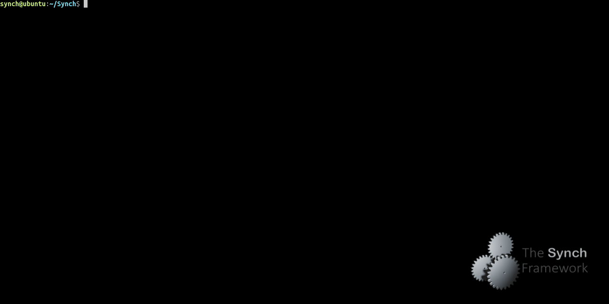

<p align="center">
    
</p>

# Summary

This is an open-source framework for concurrent data-structures and benchmarks. The provided framework 
contains a substantial set of concurrent data-structures such as `queues`, `stacks`, `combining-objects`,
`hash-tables`, `locks`, etc. This framework also provides a user-friendly runtime for developing and
benchmarking concurrent data-structures. Among other features, this runtime provides functionality 
for creating threads easily (both Posix and user-level threads), tools for measuring performance, etc.
The provided concurrent data-structures and the runtime are highly optimized for contemporary 
NUMA multiprocessors such as AMD Epyc and Intel Xeon.

The current version of this code is optimized for x86_64 machine architecture, but the code is also
successfully tested in other machine architectures, such as ARM-V8 and RISC-V. 
Some of the benchmarks perform much better in architectures that natively support Fetch&Add
instructions (e.g., x86_64, etc.).


# Running Benchmarks

For running benchmarks use the `bench.sh` script file that is provided in the main directory of this source tree.

Example usage: `./bench.sh FILE.run OPTION1=NUM1 OPTION2=NUM2 ...`

The following options are available:

|     Option              |                       Description                                                     |
| ----------------------- | ------------------------------------------------------------------------------------- |
|  `-t`, `--max_threads`  |  set the maximum number number of POSIX threads to be used in the last set of iterations of the benchmark, default is the number of system cores |
|  `-s`, `--step`         |  set the step (extra number of threads to be used) in each set of iterations of the benchmark, default is number of processors/8 or 1 |
|  `-f`, `--fibers`       |  set the number of user-level threads per posix thread                                |
|  `-r`, `--repeat`       |  set the total number of operations executed by the benchmark, default is 1000000     |
|  `-i`, `--iterations`   |  set the number of times that the benchmark should be executed, default is 10         |
|  `-w`, `--workload`     |  set the amount of workload (i.e. dummy loop iterations among two consecutive operations of the benchmarked object), default is 64 |
|  `-l`, `--list`         |  displays the list of the available benchmarks                                        |
|  `-n`, `numa_nodes`     |  set the number of numa nodes (which may differ with the actual hw numa nodes) that hierarchical algorithms should take account |
|  `-b`, `--backoff`, `--backoff_high` |  set an upper backoff bound for lock-free and Sim-based algorithms       |
|  `-bl`, `--backoff_low` |  set a lower backoff bound (only for msqueue, lfstack and lfuobject benchmarks)       |
|  `-h`, `--help`         |  displays this help and exits                                                         |

The framework provides the `validate.sh` validation/smoke script. The `validate.sh` script compiles the sources in `DEBUG` mode and runs a big set of benchmarks with various numbers of threads. After running each of the benchmarks, the script evaluates the `DEBUG` output and in case of success it prints `PASS`. In case of a failure, the script simply prints `FAIL`. In order to see all the available options of the validation/smoke script, execute `validate.sh -h`. The following image shows the execution and the default behavior of `validate.sh`.




The framework provides another simple fast smoke test: `./run_all.sh`. This will quickly run all available benchmarks with default options and store the results in the `results.txt` file.


# Collection

The current version of this library provides the following concurrent data-structures implementations:

| Concurrent  Object    |                Provided Implementations                           |
| --------------------- | ----------------------------------------------------------------- |
| Combining Objects     | CC-Synch, DSM-Synch and H-Synch [1]                               |
|                       | PSim [2,10]                                                       |
|                       | Osci [3]                                                          |
|                       | Oyama [4]                                                         |
| Concurrent Queues     | CC-Queue, DSM-Queue and H-Queue [1]                               |
|                       | SimQueue [2,10]                                                   |
|                       | OsciQueue [3]                                                     |
|                       | CLH-Queue [5,6]                                                   |
|                       | MS-Queue [7]                                                      |
| Concurrent Stacks     | CC-Stack, DSM-Stack and H-Stack [1]                               |
|                       | SimStack [2,10]                                                   |
|                       | OsciStack [3]                                                     |
|                       | CLH-Stack [5,6]                                                   |
|                       | LF-Stack [8]                                                      |
| Locks                 | CLH [5,6]                                                         |
|                       | MCS [9]                                                           |
| Hash Tables           | CLH-Hash [5,6]                                                    |
|                       | A hash-table based on DSM-Synch [1]                               |


# Requirements

- A modern 64-bit machine. Currently, 32-bit architectures are not supported. The current version of this code is optimized for the x86_64 machine architecture, but the code is also successfully tested in other machine architectures, such as ARM-V8 and RISC-V. Some of the benchmarks perform much better in architectures that natively support Fetch&Add instructions (e.g., x86_64, etc.).
- As a compiler, gcc of version 4.3 or greater is recommended, but you may also try to use icx or clang. 
- Building requires the following development packages:
    - `libnuma`
    - `libpapi` in case that the `_TRACK_CPU_COUNTERS` flag is enabled in `config.h`.

For getting the best performance, some modifications in Makefiles may be needed (compiler flags, etc.). Important parameters for the benchmarks and/or library are placed in the `config.h` file (see more on Performance/Optimizations Section).

# Compiling the library

In case that you just want to compile the library that provides all the implemented concurrent algorithms
execute one of the following make commands. This step is not necessary in case that you want to run benchmarks.

|     Command             |                                Description                                            |
| ----------------------- | ------------------------------------------------------------------------------------- |
|  `make`                 |  Auto-detects the current architecture and compiles the source-code for it.           |
|  `make CC=cc ARCH=arch` |  Compiles the source-code for the current architecture using the cc compiler.         |
|  `make clang`           |  Compiles the source-code using the clang compiler.                                   |
|  `make icx`             |  Compiles the source-code using the Intel icx compiler.                               |
|  `make unknown`         |  Compiles the source-code for architectures other than X86_64, e.g. RISC-V, ARM, etc. |
|  `make clean`           |  Cleaning-up all binary files.                                                        |

# API - Code example for a simple benchmark

We now describe a very simple example-benchmark that uses the Application Programming Interface (API) of the provided runtime. This simple benchmark measures the performance of Fetch&Add instructions in multi-core machines.

```c
#include <stdio.h>
#include <stdint.h>

#include <primitives.h>
#include <threadtools.h>
#include <barrier.h>

#define N_THREADS 10
#define RUNS      1000000

volatile int64_t object CACHE_ALIGN;
int64_t d1 CACHE_ALIGN, d2;
Barrier bar CACHE_ALIGN;

inline static void *Execute(void *Arg) {
    long i, id = (long)Arg;

    BarrierWait(&bar);
    if (id == 0) d1 = getTimeMillis();

    for (i = 0; i < RUNS; i++)
        FAA64(&object, 1);

    BarrierWait(&bar);
    if (id == 0) d2 = getTimeMillis();

    return NULL;
}

int main(int argc, char *argv[]) {
    object = 1;

    BarrierSet(&bar, N_THREADS);
    StartThreadsN(N_THREADS, Execute, _DONT_USE_UTHREADS_);
    JoinThreadsN(N_THREADS - 1);

    printf("time: %ld (ms)\tthroughput: %.2f (millions ops/sec)\n", 
           (d2 - d1), RUNS * N_THREADS / (1000.0 * (d2 - d1)));

    return 0;
}
```

This example-benchmark creates `N_THREADS`, where each of them executes `RUNS` Fetch&Add operations in a shared 64-bit integer. At the end of the benchmark the throughput (i.e. Fetch&Add operations per second) is calculated.

The `StartThreadsN` function (provided by the API defined in `threadtools.h`) in main, creates `N_THREADS` threads and each of the executes the `Execute` function declared in the same file. The `_DONT_USE_UTHREADS_` argument imposes `StartThreadsN` to create only Posix threads; in case that the user sets the corresponding fibers argument to `M` > 0, then `StartThreadsN` will create `N_THREADS` Posix threads and each of them will create `M` user-level (i.e. fiber) threads. The `JoinThreadsN` function (also provided by `threadtools. h`) waits until all Posix and fiber (if any) threads finish the execution of the `Execute` function. The Fetch&Add instruction on 64-bit integers is performed by the `FAA64` function provided by the API of `primitives.h`.

The threads executing the `Execute` function use the `Barrier` re-entrant barrier object for simultaneously starting to perform Fetch&Add instructions on the shared variable `object`. This barrier is also re-used before the end of the `Execute` function in order to allow thread with `id = 0` to measure the amount of time that the benchmark needed for completion. The `BarrierSet` function in `main` initializes the `Barrier` object. The `BarrierSet` takes as an argument a pointer to the barrier object and the number of threads `N_THREADS` that are going to use it. Both `BarrierSet` and `BarrierWait` are provided by the API of `barrier.h`

At the end of the benchmark, `main` calculates and prints the average throughput of Fetch&Add operations per second achieved by the benchmark.

# Performance/Optimizations

Getting the best performance from the provided benchmarks is not always an easy task. A useful guide to consider in order to get better performance in a modern multiprocessor follows.

- In case that the target machine is a NUMA machine make sure `NUMA_SUPPORT` is enabled in config.h. Usually, when this option is enabled, it gives much better performance in NUMA machines. However, in some older machines this option may induce performance overheads.
- Whenever the `NUMA_SUPPORT` option is enabled, the runtime will detect the system’s number of NUMA nodes and will setup the environment appropriately. However, significant performance benefits have been observed by manually setting-up the number of NUMA nodes manually (see the `--numa_nodes` option). For example, the performance of the H-Synch family algorithms on an AMD EPYC machine consisting of 2x EPYC 7501 processors (i.e., 128 hardware threads) is much better by setting `--numa_nodes` equal to `2`. Notice that the runtime successfully reports that the available NUMA nodes are `8`, but this value is not optimal for H-Synch in this configuration. An experimental analysis for different values of `--numa_nodes` may be needed.
- Check the performance impact of the `SYNCH_COMPACT_ALLOCATION` option in config.h. In modern AMD multiprocessors (i.e., equipped with EPYC processors) this option gives tremendous performance boost. In contrast to AMD processors, this option introduces serious performance overheads in Intel Xeon processors. Thus, a careful experimental analysis is needed in order to show the possible benefits of this option.
- Check the cache line size (`CACHE_LINE_SIZE` and `S_CACHE_LINE` options in includes/system.h). These options greatly affect the performance in all modern processors. Most Intel machines behave better with `CACHE_LINE_SIZE` equal or greater than `128`, while most modern AMD machine achieve better performance with a value equal to `64`. Notice that `CACHE_LINE_SIZE` and `S_CACHE_LINE` depend on the `SYNCH_COMPACT_ALLOCATION` option (see includes/system.h).
- Use backoff if it is available. Many of the provided algorithms could use backoff in order to provide better performance (e.g., sim, lfstack, msqueue, simqueue, simstack, etc.). In this case, it is of crucial importance to use `-b` (and in some cases `-bl` arguments) in order to get the best performance. 
- Ensure that you are using a recent gcc-compatible compiler, e.g. a `gcc` compiler of version `7.0` or greater is highly recommended.
- Check the performance impact of the different available compiler optimizations. In most cases, gcc's `-Ofast` option gives the best performance. In addition, some algorithms (i.e., sim, osci, simstack, oscistack, simqueue and osciqueue) benefit by enabling the `-mavx` option (in case that AVX instructions are supported by the hardware).
- Check if system oversubscription with user-level fibers enhances the performance. Many algorithms (i.e., the Sim and Osci families of algorithms) show tremendous performance boost by using oversubscription with user-level threads [3]. In this case, use the `--fibers` option.

# If you want to cite us

```latex
@misc{SynchFramework,
  title={{Synch: A framework for concurrent data-structures and benchmarks.}},
  author={Kallimanis, Nikolaos D.},
  url={{https://github.com/nkallima/sim-universal-construction}}
}
```

# Releases

An extensive list of the recent releases and their features is provided at [https://github.com/nkallima/sim-universal-construction/releases](https://github.com/nkallima/sim-universal-construction/releases)

# License

The Synch framework is provided under the [LGPL-2.1 License](LICENSE).

# Code of conduct

[Code of conduct](.github/CODE_OF_CONDUCT.md).

# References

[1]. Panagiota Fatourou, and Nikolaos D. Kallimanis. "Revisiting the combining synchronization technique". ACM SIGPLAN Notices. Vol. 47. No. 8. ACM, PPoPP 2012.

[2]. Panagiota Fatourou, and Nikolaos D. Kallimanis. "A highly-efficient wait-free universal construction". Proceedings of the twenty-third annual ACM symposium on Parallelism in algorithms and architectures (SPAA), 2011.

[3]. Panagiota Fatourou, and Nikolaos D. Kallimanis. "Lock Oscillation: Boosting the Performance of Concurrent Data Structures" Proceedings of the 21st International Conference on Principles of Distributed Systems (Opodis), 2017.

[4]. Yoshihiro Oyama, Kenjiro Taura, and Akinori Yonezawa. "Executing parallel programs with synchronization bottlenecks efficiently". Proceedings of the International Workshop on Parallel and Distributed Computing for Symbolic and Irregular Applications. Vol. 16. 1999.

[5]. T. S. Craig. "Building FIFO and priority-queueing spin locks from atomic swap". Technical Report TR 93-02-02, Department of Computer Science, University of Washington, February 1993.

[6]. Peter Magnusson, Anders Landin, and Erik Hagersten. "Queue locks on cache coherent multiprocessors". Parallel Processing Symposium, 1994. Proceedings., Eighth International. IEEE, 1994.
    
[7]. Maged M. Michael, and Michael L. Scott. "Simple, fast, and practical non-blocking and blocking concurrent queue algorithms". Proceedings of the fifteenth annual ACM symposium on Principles of distributed computing. ACM, 1996.
    
[8]. Treiber, R. Kent. "Systems programming: Coping with parallelism". International Business Machines Incorporated, Thomas J. Watson Research Center, 1986.

[9]. Mellor-Crummey, John M., and Michael L. Scott. "Algorithms for scalable synchronization on shared-memory multiprocessors". ACM Transactions on Computer Systems (TOCS) 9.1 (1991): 21-65.

[10]. Panagiota Fatourou, and Nikolaos D. Kallimanis. "Highly-efficient wait-free synchronization." Theory of Computing Systems 55.3 (2014): 475-520.

# Contact

For any further information, please do not hesitate to
send an email at nkallima (at) ics.forth.gr. Feedback is always valuable.

